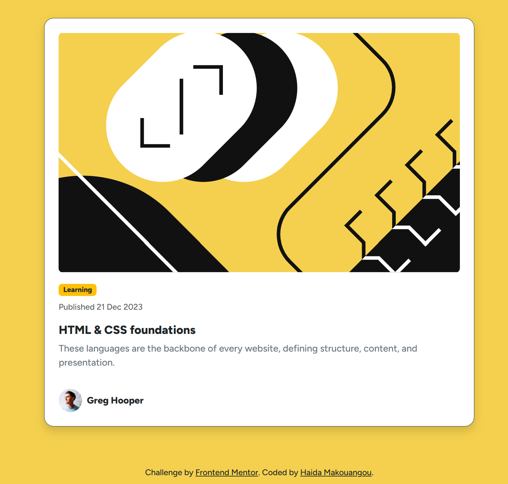

## Frontend Mentor - Blog Preview Card component solution (Bootstrap Refactor)

This is a solution to the [Blog Preview Card component challenge on Frontend Mentor](https://www.frontendmentor.io/challenges/blog-preview-card-component-8bZkQhJ8). The project was refactored using Bootstrap’s utility classes and components to simplify and enhance the layout and design.

## Table of contents

- [Overview](#overview)
  - [Screenshot](#screenshot)
- [My process](#my-process)
  - [Built with](#built-with)
  - [What I learned](#what-i-learned)
  - [Continued development](#continued-development)
  - [Useful resources](#useful-resources)
- [Author](#author)
- [Acknowledgments](#acknowledgments)

## Overview

### Screenshot

## My process

### Built with

- Semantic HTML5 markup
- Bootstrap 5 (Grid, components, utility classes)
- Mobile-first workflow

### What I learned

Refactoring this project helped me:

- Use Bootstrap’s card component to create a more consistent layout
- Use utility classes for margin, padding, and typography adjustments
- Utilize Bootstrap's grid system to create responsive layouts

### Continued development

I plan to continue enhancing this project by:

- Experimenting with more advanced Bootstrap components like carousels or modals
- Adding custom styles by overriding Bootstrap variables using Sass
- Ensuring full responsiveness for larger devices

### Useful resources

- [Bootstrap Documentation](https://getbootstrap.com/docs/5.3/getting-started/introduction/)
- [MDN Web Docs](https://developer.mozilla.org/)

## Author

- GitHub - [HaidaMarese](https://github.com/HaidaMarese)

## Acknowledgments

Thanks to Frontend Mentor for the challenge and the opportunity to improve my front-end skills by working with Bootstrap.
